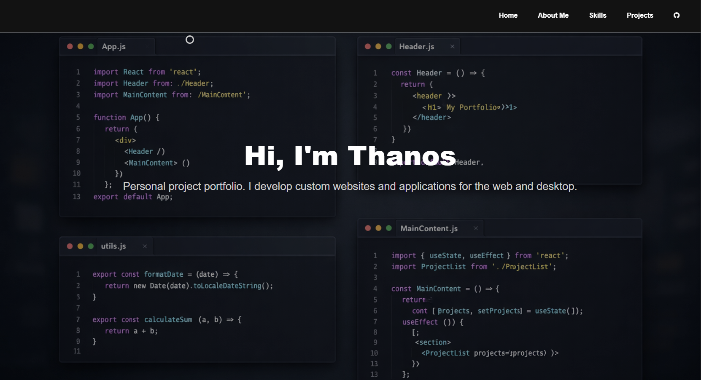
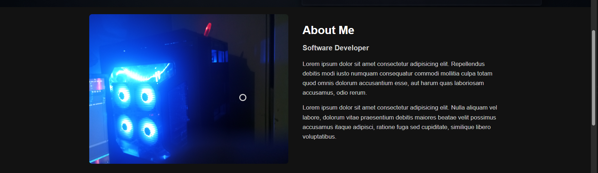
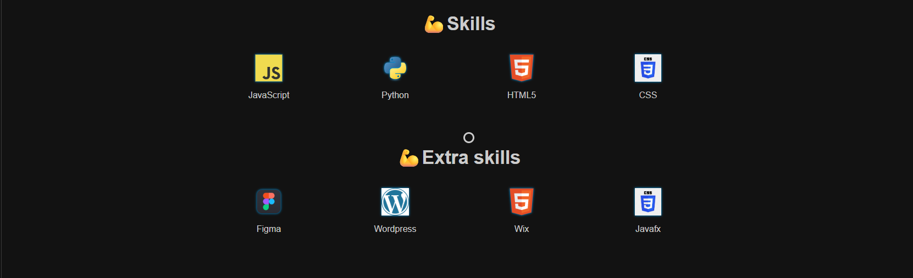
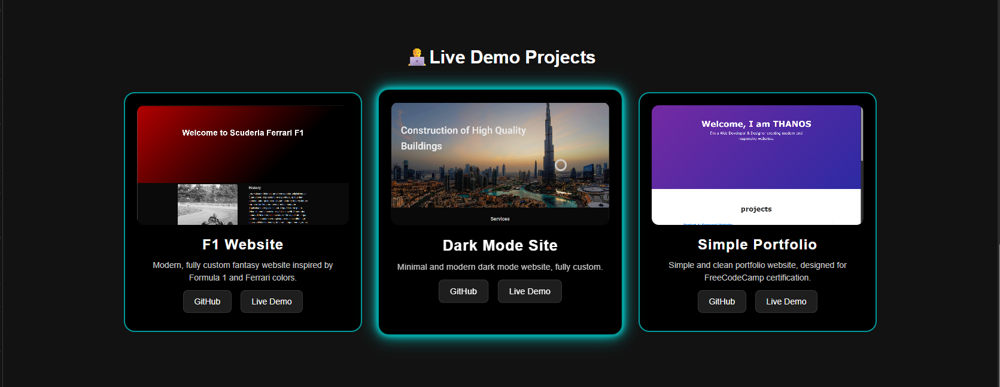
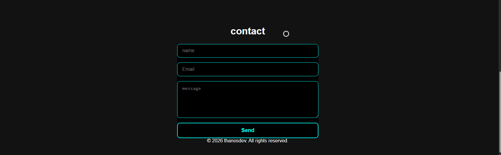

 


# 🚀 Modern Portfolio Starter

A clean, responsive, and beginner-friendly portfolio template built with pure HTML & CSS.

Designed for junior developers who want a solid starting point to build and customize their personal portfolio.

---

## ✨ Features 

* 📱 Fully Responsive (Mobile / Tablet / Desktop)
* 🎨 Modern Dark UI Design
* ⚡ Smooth animations & hover effects
* 🧩 Sections included:

  * Hero (Landing)
  * About Me
  * Skills
  * Projects
  * Contact Form
* 🧼 Clean and readable code structure
* 🔧 Easy to customize

---

## 🛠️ Tech Stack

* HTML5
* CSS3 (Flexbox & Grid)
* Vanilla JavaScript (for menu toggle)

---

## 📂 Project Structure

```
portfolio/
│── index-1.html
│── style.css
│── script.js
│── images/
```

---

## 🚀 Getting Started

1. Clone the repository:

```bash
git clone https://github.com/thanos-coder2/portfolio-templates-bundle.git
```

2. Open `index-en.html` in your browser

3. Customize:

* Change texts
* Replace images
* Update colors
* Add your own projects

---

## 🎯 هدف (Who is this for?)

* Junior developers
* Students learning frontend
* Anyone building their first portfolio

---

## 💡 Tips

* Keep your portfolio simple and clean
* Focus on your best projects
* Add real screenshots instead of placeholders
* Deploy it (GitHub Pages recommended)

---

🤝 Contributing

Contributions, improvements, and ideas are always welcome!

If you’d like to upgrade or improve this portfolio template, feel free to:

🔧 What you can improve
Enhance UI/UX design
Add new sections (e.g. blog, testimonials, dark/light mode toggle)
Improve responsiveness
Refactor or optimize code
Add animations or micro-interactions
Improve accessibility (a11y)
Fix bugs

---

## 📜 License

This project is open-source and free to use.

---

# 🇬🇷 Modern Portfolio Starter (Ελληνικά)

Ένα καθαρό, responsive και εύκολο portfolio template για αρχάριους developers.

Σχεδιασμένο για να σε βοηθήσει να χτίσεις το πρώτο σου επαγγελματικό portfolio.

---

## ✨ Χαρακτηριστικά

* 📱 Responsive σε όλες τις συσκευές
* 🎨 Σύγχρονο dark design
* ⚡ Animations και hover effects
* 🧩 Περιλαμβάνει sections:

  * Αρχική (Hero)
  * About Me
  * Skills
  * Projects
  * Contact Form
* 🧼 Καθαρός και οργανωμένος κώδικας
* 🔧 Εύκολη προσαρμογή

---

## 🛠️ Τεχνολογίες

* HTML5
* CSS3 (Flexbox & Grid)
* JavaScript (για mobile menu)

---

## 🚀 Πως να ξεκινήσεις

1. Κάνε clone το repo:

```bash
git clone https://github.com/thanos-coder2/portfolio-templates-bundle.git
```

2. Άνοιξε το `index-en.html`

3. Προσαρμογή:

* Άλλαξε κείμενα
* Βάλε δικές σου εικόνες
* Πρόσθεσε projects
* Άλλαξε colors

---

## 🎯 Σε ποιους απευθύνεται

* Αρχάριους developers
* Φοιτητές
* Όποιον θέλει να φτιάξει portfolio

---

## 💡 Συμβουλές

* Κράτα το απλό και καθαρό
* Βάλε μόνο τα καλύτερα projects
* Χρησιμοποίησε πραγματικά screenshots
* Κάνε deploy (GitHub Pages)

---

## Συνεισφορά (Contributing)

Μπορείς ελεύθερα να βελτιώσεις ή να αναβαθμίσεις το project!

🔧 Τι μπορείς να βελτιώσεις
UI/UX design
Νέα sections (blog, testimonials, dark/light mode)
Responsive design
Βελτιστοποίηση κώδικα
Animations
Accessibility
Διορθώσεις bugs

## 📜 Άδεια

Ελεύθερο για χρήση (open-source)

---

## 🙌 Contributing

Feel free to fork, improve, and share your version!
