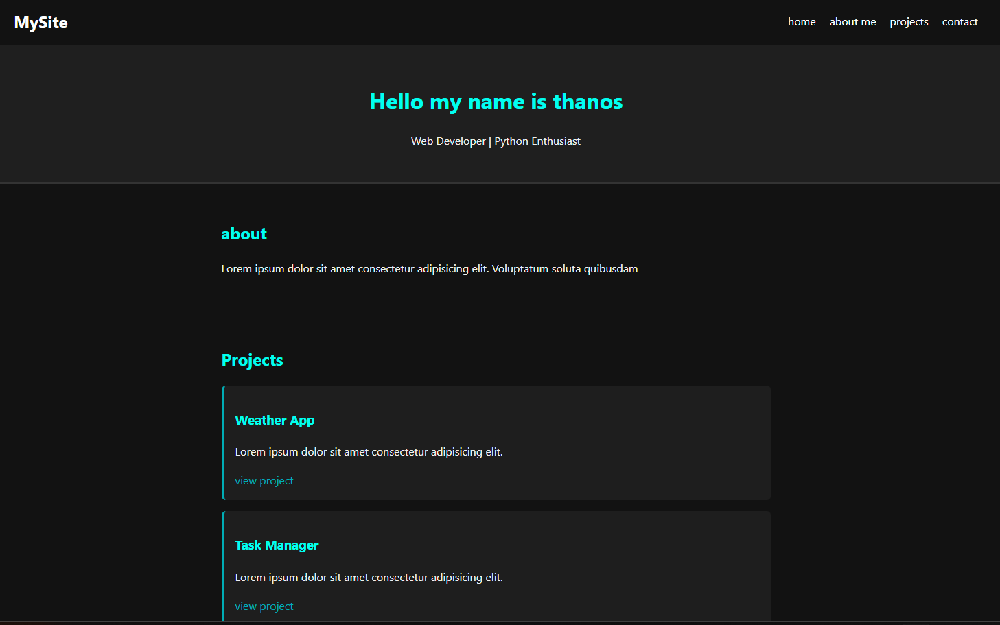
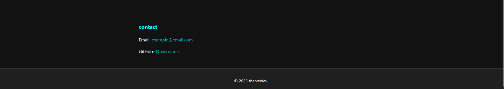

# 🌐 Mini Portfolio Website




## 🇬🇧 English

### 📌 Overview

This is a simple and clean **mini portfolio website** built using pure HTML and CSS.
It is designed to showcase basic web development skills, personal information, and small projects.

---

### 🚀 Features

* Responsive navigation bar
* Hero section with introduction
* About section
* Projects showcase
* Contact section (email & GitHub)
* Dark theme UI

---

### 🛠️ Technologies Used

* HTML5
* CSS3 (Flexbox & basic styling)

---

### 📂 Project Structure

```
portfolio-2/
│── index.html
```

---

### 📸 Sections Breakdown

* **Navbar** → Navigation links (Home, About, Projects, Contact)
* **Header** → Introduction (name & role)
* **About** → Short description
* **Projects** → Example projects with links
* **Contact** → Email & GitHub profile
* **Footer** → Copyright

---

### ⚠️ Notes / Improvements

This is a beginner-level project. Possible future improvements:

* Add JavaScript interactivity
* Connect real project links
* Improve UI/UX design
* Add animations
* Make it fully responsive for all devices

---


## 🇬🇷 Ελληνικά


### 📌 Περιγραφή

Αυτό είναι ένα απλό και καθαρό **mini portfolio website** φτιαγμένο με HTML και CSS.
Σκοπός του είναι να παρουσιάσει βασικές γνώσεις web development, προσωπικά στοιχεία και μικρά projects.

---

### 🚀 Χαρακτηριστικά

* Responsive navigation bar
* Εισαγωγική ενότητα (hero section)
* Ενότητα "About me"
* Παρουσίαση projects
* Ενότητα επικοινωνίας
* Dark theme σχεδιασμός

---

### 🛠️ Τεχνολογίες

* HTML5
* CSS3

---

### 📂 Δομή Project

```
portfolio/
│── index.html
```

---

### 📸 Δομή Σελίδας

* **Navbar** → Μενού πλοήγησης
* **Header** → Παρουσίαση (όνομα & ρόλος)
* **About** → Περιγραφή
* **Projects** → Projects με links
* **Contact** → Email & GitHub
* **Footer** → Πνευματικά δικαιώματα

---

### ⚠️ Βελτιώσεις (Future Work)

* Προσθήκη JavaScript
* Σύνδεση πραγματικών projects
* Βελτίωση design (UI/UX)
* Animations
* Πλήρως responsive design

---

## ⭐ License

This project is open-source and free to use.
